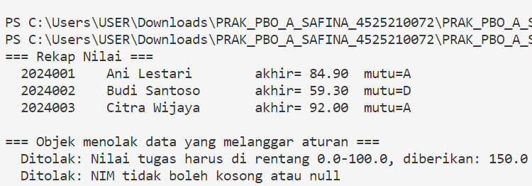
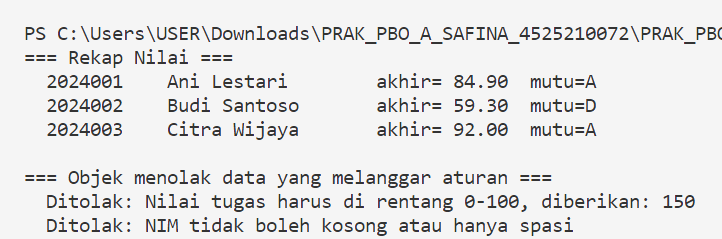

# Praktikum Pertemuan 02 — Kelas, Objek, dan Enkapsulasi

**Nama:** Syabita Putri Safina  
**NPM:** 4525210072  
**Praktikum :** Pemrograman Berorientasi Objek  
**Dosen Pengampu:** Adi Wahyu Pribadi, S.Si., M.Kom

## 1. File `Mahasiswa.java` dan `Mahasiswa.php`

### Sebelum Perbaikan

Pada tahap awal, class `Mahasiswa` masih memiliki beberapa bagian yang belum diimplementasikan. Validasi NIM dan nilai mahasiswa belum tersedia, sehingga data yang tidak sesuai aturan masih berpotensi diterima oleh program.

Selain itu, method `nilaiAkhir()` masih mengembalikan nilai `0`, sedangkan method `hurufMutu()` masih menghasilkan tanda tanya (`?`). Dengan kondisi tersebut, program belum bisa menghitung nilai akhir dan menentukan huruf mutu berdasarkan nilai mahasiswa.

### Setelah Perbaikan

Setelah dilakukan perbaikan, class `Mahasiswa` pada Java dan PHP sudah dilengkapi dengan beberapa fungsi utama:

1. **Validasi NIM:** program menolak NIM yang kosong agar setiap mahasiswa memiliki identitas yang valid.
2. **Validasi komponen nilai:** method `pastikanNilaiSah()` memastikan nilai tugas, UTS, dan UAS berada pada rentang 0 sampai 100.
3. **Perhitungan nilai akhir:** method `nilaiAkhir()` menghitung nilai berdasarkan bobot tugas sebesar 30%, UTS sebesar 30%, dan UAS sebesar 40%.
4. **Penentuan huruf mutu:** method `hurufMutu()` menentukan predikat A, B, C, D, atau E berdasarkan nilai akhir.
5. **Enkapsulasi atribut:** atribut dibuat `private` agar akses terhadap data dapat dikendalikan melalui class.
6. **Tampilan objek:** method `toString()` pada Java dan `__toString()` pada PHP digunakan untuk menampilkan informasi mahasiswa dalam format yang teratur.

Perbaikan tersebut membuat class `Mahasiswa` dapat mengolah data sekaligus menjaga agar data yang diterima sesuai dengan aturan yang ditentukan.

## 2. File `Main.java` dan `Main.php`

### Sebelum Perbaikan

Program pengujian telah menyiapkan data tiga mahasiswa dan dua skenario untuk menguji data yang tidak valid. Namun, karena validasi dan perhitungan pada class `Mahasiswa` belum lengkap, program belum dapat menghasilkan seluruh keluaran yang diharapkan.

### Setelah Perbaikan

Program pengujian digunakan untuk memeriksa hasil perbaikan pada class `Mahasiswa`. Pengujian dilakukan melalui beberapa langkah:

1. Membuat tiga objek mahasiswa dengan nilai tugas, UTS, dan UAS yang berbeda.
2. Menampilkan rekap nilai setiap mahasiswa.
3. Mencoba memasukkan nilai tugas sebesar 150 untuk memastikan nilai di luar batas ditolak.
4. Membuat objek dengan NIM kosong untuk menguji validasi identitas mahasiswa.
5. Menangkap exception dan menampilkan pesan penolakan ketika data tidak memenuhi ketentuan.

Melalui pengujian tersebut, dapat diperiksa apakah program mampu mengolah data mahasiswa yang valid dan menolak data yang melanggar aturan.

## 3. Hasil Pengujian Program

### Hasil Program Java

Masukkan screenshot hasil eksekusi `Main.java` di bawah ini.

### Hasil Program PHP

Masukkan screenshot hasil eksekusi `Main.php` di bawah ini.

## 4. Kesimpulan

Praktikum Pertemuan 02 membahas penerapan enkapsulasi dan validasi data dalam pemrograman berorientasi objek. Melalui perbaikan class `Mahasiswa`, program dapat menghitung nilai akhir berdasarkan bobot yang ditetapkan, menentukan huruf mutu, serta menolak data yang tidak memenuhi aturan.

Pengujian menggunakan program Java dan PHP membantu memastikan bahwa validasi berjalan sesuai kebutuhan. Dengan demikian, enkapsulasi tidak hanya membatasi akses terhadap atribut, tetapi juga membantu menjaga konsistensi data di dalam objek.