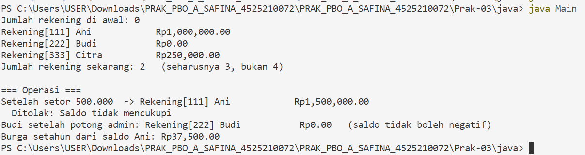
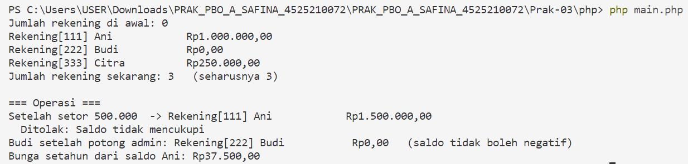

# Praktikum Pertemuan 03 — Constructor, Anggota Statis, dan Konstanta

**Nama:** Syabita Putri Safina  
**NPM:** 4525210072  
**Mata Kuliah:** Pemrograman Berorientasi Objek  
**Dosen Pengampu:** Adi Wahyu Pribadi, S.Si., M.Kom

## 1. File `RekeningBank.php`

### Sebelum Perbaikan

Pada kode awal, class `RekeningBank` masih memiliki beberapa bagian yang belum selesai. Konstanta untuk bunga tahunan, biaya administrasi, dan batas penarikan belum dibuat. Selain itu, penghitung jumlah rekening, validasi data rekening, serta beberapa operasi transaksi masih berupa TODO.

Method `rekeningPelajar()` juga belum diimplementasikan, sedangkan method `getJumlahRekening()` dan `bungaSetahun()` masih mengembalikan nilai sementara. Akibatnya, class belum dapat menjalankan seluruh fitur rekening bank sesuai ketentuan praktikum.

### Setelah Perbaikan

Pada tahap perbaikan, class `RekeningBank` dilengkapi agar dapat mengelola saldo dan transaksi rekening. Perbaikan yang perlu diterapkan meliputi:

1. **Konstanta rekening:** mendefinisikan nilai tetap untuk bunga tahunan, biaya administrasi, dan batas penarikan.
2. **Penghitung rekening:** menambahkan properti statis untuk menghitung jumlah objek rekening yang dibuat.
3. **Validasi data:** memastikan nomor rekening tidak kosong dan saldo awal tidak bernilai negatif.
4. **Named constructor:** menyediakan method `rekeningPelajar()` untuk membuat rekening dengan saldo awal nol menggunakan `new static()`.
5. **Setor dan tarik saldo:** melengkapi transaksi setor serta penarikan dengan pemeriksaan jumlah transaksi, saldo yang tersedia, dan batas penarikan.
6. **Biaya administrasi:** mengurangi saldo sesuai biaya admin tanpa membiarkan saldo menjadi negatif.
7. **Perhitungan bunga:** menyediakan method untuk menghitung bunga tahunan berdasarkan saldo pokok.

Perbaikan tersebut bertujuan agar setiap transaksi rekening mengikuti aturan yang sudah ditentukan.

## 2. File `Main.java`

### Sebelum Perbaikan

Program utama disiapkan untuk menguji pembuatan rekening, jumlah objek, transaksi setor dan tarik, pemotongan biaya administrasi, serta perhitungan bunga. Namun, hasil pengujian bergantung pada implementasi class `RekeningBank`. Jika method yang dipanggil belum tersedia atau belum berfungsi, program tidak dapat menghasilkan keluaran yang diharapkan.

### Setelah Perbaikan

Program utama digunakan untuk memeriksa fitur-fitur rekening bank melalui beberapa skenario:

1. Menampilkan jumlah rekening sebelum objek dibuat.
2. Membuat tiga rekening atas nama Ani, Budi, dan Citra dengan saldo awal yang berbeda.
3. Menampilkan informasi setiap rekening dan memeriksa jumlah rekening yang tercatat.
4. Melakukan penyetoran sebesar Rp500.000 ke rekening Ani.
5. Mencoba penarikan sebesar Rp9.999.999 untuk menguji batas penarikan.
6. Memotong biaya administrasi rekening Budi dan memeriksa agar saldonya tidak negatif.
7. Menghitung bunga tahunan berdasarkan saldo rekening Ani.

Melalui pengujian ini, program dapat digunakan untuk memeriksa apakah pengelolaan saldo dan aturan transaksi berjalan sesuai rancangan.

## 3. Hasil Pengujian Program

### Hasil Java

Masukkan screenshot hasil eksekusi program Java pada bagian ini.

### Hasil PHP

Masukkan screenshot hasil eksekusi program PHP pada bagian ini.

## 4. Kesimpulan

Praktikum Pertemuan 03 membahas pengelolaan objek rekening bank melalui constructor, konstanta, properti statis, dan method transaksi. Selain itu, praktikum ini memperkenalkan penggunaan named constructor pada PHP sebagai pendekatan untuk menyediakan cara pembuatan objek dengan tujuan tertentu.

Melalui pengujian program, dapat dipelajari pentingnya validasi transaksi, pembatasan penarikan, penghitungan jumlah rekening, dan perhitungan bunga agar pengelolaan saldo berjalan sesuai aturan yang ditetapkan.