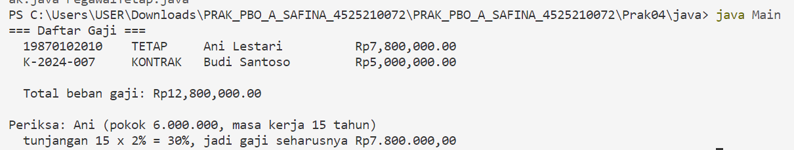
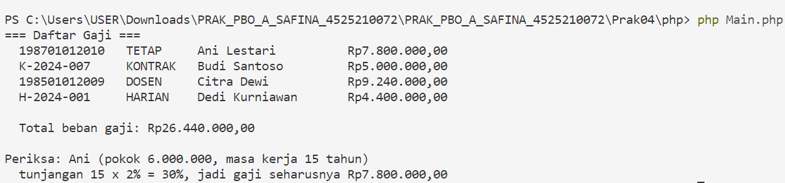

# **Praktikum Pertemuan 04 — Hierarki Pegawai (Inheritance)**

**Nama:** Syabita Putri Safina  
**NPM:** 4525210072  
**Mata Kuliah:** Pemrograman Berorientasi Objek  
**Dosen Pengampu:** Adi Wahyu Pribadi, S.Si., M.Kom

## **1. File `Pegawai.java`**

### **Sebelum Perbaikan**

Pada kode awal, class `PegawaiTetap` masih memiliki method `hitungGaji()` yang mengembalikan nilai sementara, yaitu `0`. Akibatnya, perhitungan gaji pegawai tetap beserta tunjangan masa kerja belum dapat dilakukan sesuai ketentuan praktikum.

Selain itu, terdapat instruksi untuk menghapus sementara pemanggilan `super(nip, nama, gajiPokok)` dan mengamati pesan kesalahan kompilasi. Langkah ini bertujuan untuk memahami bahwa constructor kelas induk harus dipanggil terlebih dahulu sebelum inisialisasi atribut pada kelas turunan.

### **Setelah Perbaikan**

Pada tahap perbaikan, kelas `Pegawai` dibuat sebagai kelas abstrak yang menjadi induk bagi berbagai jenis pegawai. Perbaikan yang diterapkan meliputi:

1. **Validasi gaji pokok:** menolak nilai gaji pokok negatif menggunakan `IllegalArgumentException`.
2. **Perhitungan gaji dasar:** mengembalikan nilai gaji pokok melalui method `hitungGaji()`.
3. **Kelas abstrak:** menjadikan `Pegawai` sebagai kelas dasar yang tidak dapat dibuat objeknya secara langsung.
4. **Method abstrak:** menyediakan method `jenis()` yang harus diimplementasikan oleh kelas turunannya.
5. **Informasi pegawai:** menyediakan method `getNama()` dan `getNip()` untuk mengakses data pegawai.
6. **Representasi objek:** menggunakan `toString()` untuk menampilkan informasi pegawai beserta hasil perhitungan gajinya.

Perbaikan tersebut bertujuan agar kelas induk dapat menjadi dasar yang terstruktur bagi kelas-kelas pegawai lainnya.

## **2. File `Pegawai.php`**

### **Sebelum Perbaikan**

Pada kode awal PHP, class `Pegawai` masih memiliki beberapa bagian yang belum selesai. Validasi terhadap gaji pokok negatif belum diterapkan, sedangkan method `hitungGaji()` masih mengembalikan nilai sementara `0`.

Selain itu, perhitungan gaji pegawai tetap belum diterapkan dan kelas `Dosen` serta `PegawaiHarian` belum dibuat. Akibatnya, hierarki pegawai belum dapat menjalankan seluruh perhitungan gaji sesuai ketentuan praktikum.

### **Setelah Perbaikan**

Pada tahap perbaikan, hierarki pegawai dalam PHP dilengkapi agar dapat menghitung gaji berdasarkan jenis pegawai. Perbaikan yang diterapkan meliputi:

1. **Kelas `Pegawai`:** menerapkan validasi gaji pokok dan menyediakan perhitungan gaji dasar.
2. **Kelas `PegawaiTetap`:** menghitung gaji dasar ditambah tunjangan masa kerja sebesar 2% per tahun, dengan batas maksimum 40%.
3. **Kelas `PegawaiKontrak`:** menyimpan informasi masa kontrak dalam bulan dan menampilkan jenis pegawai sebagai `KONTRAK`.
4. **Kelas `Dosen`:** merupakan turunan dari `PegawaiTetap` yang memperoleh tambahan tunjangan fungsional sebesar 10% dari hasil perhitungan gaji pegawai tetap.
5. **Kelas `PegawaiHarian`:** menghitung gaji dengan mengalikan gaji per hari dengan jumlah hari kerja.
6. **Pewarisan dan overriding:** menggunakan pewarisan kelas serta implementasi ulang method `hitungGaji()` dan `jenis()` sesuai kebutuhan setiap jenis pegawai.

Perbaikan tersebut bertujuan agar setiap jenis pegawai dapat memiliki perhitungan gaji yang sesuai tanpa harus menuliskan ulang seluruh fungsi dari kelas induk.

## **3. Hasil Pengujian Program**

### **Hasil Java**

Masukkan screenshot hasil eksekusi program Java pada bagian ini.

### **Hasil PHP**

Masukkan screenshot hasil eksekusi program PHP pada bagian ini.

## **4. Kesimpulan**

Praktikum Pertemuan 04 membahas penerapan konsep *Inheritance* atau pewarisan dalam pemrograman berorientasi objek menggunakan Java dan PHP. Melalui praktikum ini, dipelajari penggunaan kelas abstrak, constructor kelas induk, method overriding, serta pemanggilan method dari kelas induk menggunakan `super` pada Java dan `parent` pada PHP.

Selain itu, praktikum ini menunjukkan bahwa setiap kelas turunan dapat memiliki perilaku dan perhitungan gaji yang berbeda sesuai kebutuhan. Dengan menerapkan konsep pewarisan, program menjadi lebih terstruktur, mudah dikembangkan, dan mengurangi penulisan kode yang berulang.