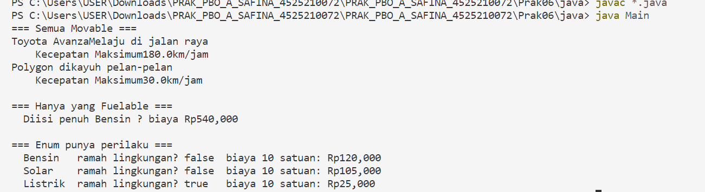
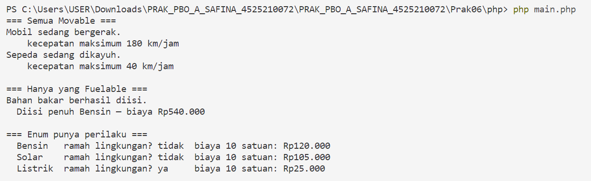

# **Praktikum Pertemuan 06 — Abstract Class, Interface, Enum, dan Trait**

**Nama:** Syabita Putri Safina  
**NPM:** 4525210072  
**Mata Kuliah:** Pemrograman Berorientasi Objek  
**Dosen Pengampu:** Adi Wahyu Pribadi, S.Si., M.Kom

## **1. File `Mobil.java` dan Komponen Java**

### **Sebelum Perbaikan**

Pada kode awal, beberapa bagian program belum diimplementasikan secara lengkap. Method `bergerak()` belum menampilkan informasi pergerakan kendaraan, method `kecepatanMaksimum()` belum mengembalikan nilai kecepatan yang sesuai, dan method `isiBahanBakar()` belum memiliki validasi untuk jumlah bahan bakar yang dimasukkan. Selain itu, program perlu memastikan bahwa pengisian bahan bakar tidak melebihi kapasitas tangki.

### **Setelah Perbaikan**

Setelah dilakukan perbaikan, komponen Java dilengkapi dengan fungsi sesuai kebutuhan program.

1. **Abstract class `Kendaraan`** digunakan sebagai kelas dasar yang menyimpan atribut merek dan tahun kendaraan serta menyediakan method umum seperti `umur()` dan `toString()`.
2. **Interface `Movable`** menentukan method `bergerak()` dan `kecepatanMaksimum()` yang harus dimiliki kendaraan yang dapat bergerak.
3. **Interface `Fuelable`** menentukan method untuk pengisian bahan bakar, kapasitas tangki, dan jenis bahan bakar.
4. **Class `Mobil`** mewarisi `Kendaraan` serta mengimplementasikan `Movable` dan `Fuelable`. Mobil memiliki empat roda, kecepatan maksimum 180 km/jam, dan kapasitas tangki sesuai nilai yang diberikan pada konstruktor.
5. **Class `Sepeda`** mewarisi `Kendaraan` dan mengimplementasikan `Movable`, tetapi tidak mengimplementasikan `Fuelable` karena sepeda tidak menggunakan bahan bakar.
6. **Enum `TipeBahanBakar`** menyimpan jenis bahan bakar, harga per satuan, perhitungan biaya pengisian, dan informasi apakah bahan bakar ramah lingkungan.
7. **Method `isiPenuh()`** menerima objek bertipe `Fuelable`, sehingga hanya objek yang memenuhi kontrak tersebut yang dapat digunakan untuk pengisian bahan bakar.

## **2. File PHP**

### **Sebelum Perbaikan**

Pada kode awal PHP, beberapa method masih berupa kerangka dan belum memiliki implementasi. Enum `TipeBahanBakar` belum memiliki label, harga, perhitungan biaya, dan informasi ramah lingkungan yang sesuai. Trait `Loggable` belum menampilkan format log yang ditentukan. Method `umur()` juga belum menghitung usia kendaraan dengan benar.

Selain itu, class `Sepeda` dan `Pesanan` belum dibuat, sedangkan method pada class `Mobil` masih perlu dilengkapi agar sesuai dengan interface yang diterapkan.

### **Setelah Perbaikan**

Setelah dilakukan perbaikan, program PHP memiliki beberapa komponen berikut.

1. **Interface `Movable` dan `Fuelable`** digunakan untuk menentukan method yang harus dimiliki oleh objek sesuai kemampuannya.
2. **Enum `TipeBahanBakar`** memiliki tiga jenis bahan bakar, yaitu bensin, solar, dan listrik. Enum ini juga menyediakan label, harga per satuan, perhitungan biaya pengisian, dan pemeriksaan ramah lingkungan.
3. **Trait `Loggable`** menyediakan method `log()` yang dapat digunakan kembali oleh kelas berbeda untuk menampilkan catatan aktivitas.
4. **Abstract class `Kendaraan`** menyimpan atribut umum kendaraan dan menyediakan method untuk menghitung umur serta menampilkan informasi kendaraan.
5. **Class `Mobil`** mewarisi `Kendaraan`, mengimplementasikan `Movable` dan `Fuelable`, serta menggunakan trait `Loggable`.
6. **Class `Sepeda`** hanya mengimplementasikan `Movable`, sehingga objek sepeda tidak dapat digunakan sebagai argumen fungsi `isiPenuh()` yang membutuhkan objek `Fuelable`.
7. **Class `Pesanan`** menggunakan trait `Loggable` meskipun tidak memiliki hubungan pewarisan dengan `Kendaraan`. Hal ini menunjukkan bahwa trait dapat digunakan kembali oleh kelas yang berbeda.

## **3. Hasil Pengujian Program**

### **Hasil Java**

Masukkan screenshot hasil eksekusi program Java pada bagian ini.

### **Hasil PHP**

Masukkan screenshot hasil eksekusi program PHP pada bagian ini.

Pengujian dilakukan untuk memastikan bahwa objek `Mobil` dan `Sepeda` dapat menjalankan perilaku bergerak, informasi jenis bahan bakar dapat ditampilkan, dan trait dapat digunakan oleh kelas yang berbeda. Pengujian juga menunjukkan bahwa objek `Sepeda` tidak memenuhi tipe parameter `Fuelable` pada fungsi `isiPenuh()`.

## **4. Kesimpulan**

Pada praktikum pertemuan keenam, saya mempelajari penggunaan abstract class, interface, enum, dan trait dalam pemrograman berorientasi objek menggunakan Java dan PHP. Abstract class digunakan untuk menyediakan struktur dan perilaku umum, sedangkan interface menentukan kontrak kemampuan yang harus diterapkan oleh kelas. Enum digunakan untuk mengelompokkan nilai beserta perilakunya, sementara trait pada PHP memungkinkan penggunaan kembali method oleh kelas yang tidak memiliki hubungan pewarisan.

Melalui praktikum ini, saya juga memahami bahwa sebuah kelas dapat mengimplementasikan beberapa interface sesuai kebutuhannya. Penerapan kontrak tipe membantu program menjadi lebih terstruktur dan mencegah objek yang tidak memiliki kemampuan tertentu digunakan pada fungsi yang tidak sesuai.