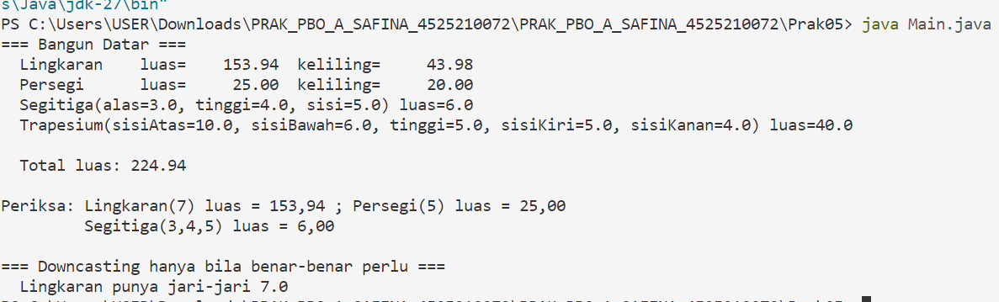
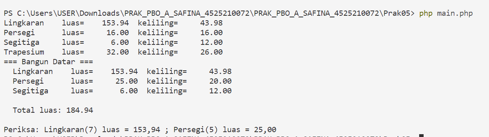

# **Praktikum Pertemuan 05 — Polimorfisme**

**Nama:** Syabita Putri Safina  
**NPM:** 4525210072  
**Mata Kuliah:** Pemrograman Berorientasi Objek  
**Dosen Pengampu:** Adi Wahyu Pribadi, S.Si., M.Kom

## **1. File `BangunDatar.php`**

### **Sebelum Perbaikan**

Pada file `BangunDatar.php`, kelas abstrak `BangunDatar` sudah dibuat dengan atribut nama, method abstrak `luas()` dan `keliling()`, serta method `getNama()` dan `__toString()`. Namun, kelas `Lingkaran` dan `Persegi` masih memiliki beberapa bagian yang belum selesai.

Perhitungan luas dan keliling masih mengembalikan nilai `0`, validasi ukuran belum diterapkan, serta kelas `Segitiga` dan `Trapesium` belum dibuat.

### **Setelah Perbaikan**

Perbaikan dilakukan dengan melengkapi perhitungan, menambahkan validasi, dan membuat kelas turunan yang mewarisi kelas abstrak `BangunDatar`.

1. **Kelas `BangunDatar`** digunakan sebagai kelas induk abstrak yang menyediakan method `luas()` dan `keliling()` untuk diimplementasikan oleh kelas turunannya.
2. **Kelas `Lingkaran`** menggunakan rumus luas \(\pi r^2\) dan keliling \(2\pi r\). Nilai jari-jari harus lebih besar dari nol dan perhitungan menggunakan `M_PI`.
3. **Kelas `Persegi`** menggunakan rumus luas \(s \times s\) dan keliling \(4s\). Nilai sisi harus lebih besar dari nol.
4. **Kelas `Segitiga`** dibuat sebagai turunan `BangunDatar`. Perhitungan luas menggunakan rumus Heron, sedangkan keliling diperoleh dari penjumlahan ketiga sisinya. Ketiga sisi harus memenuhi syarat pembentukan segitiga.
5. **Kelas `Trapesium`** dibuat sebagai turunan `BangunDatar`. Luas dihitung menggunakan setengah jumlah sisi sejajar dikalikan tinggi, sedangkan keliling dihitung dari jumlah keempat sisinya.

## **2. File `Main.java`**

### **Sebelum Perbaikan**

Pada file `Main.java`, objek `Lingkaran` dan `Persegi` sudah dimasukkan ke dalam array bertipe `BangunDatar`. Program juga sudah menggunakan perulangan untuk menampilkan objek dan menghitung total luas.

Namun, objek `Segitiga` dan `Trapesium` belum dimasukkan ke dalam array. Akibatnya, kedua bangun datar tersebut belum ikut ditampilkan dan dihitung dalam total luas.

### **Setelah Perbaikan**

Objek `Segitiga` dan `Trapesium` ditambahkan ke dalam array `daftar`, sehingga seluruh objek bangun datar dapat diproses menggunakan tipe induk `BangunDatar`.

Perbaikan dilakukan dengan menambahkan baris berikut:

```java
new Segitiga(3.0, 4, 5),
new Trapesium(10, 6, 5, 5, 4)
```

Logika perulangan tidak diubah. Setiap objek menjalankan implementasi method `luas()` dan `toString()` sesuai kelasnya masing-masing. Hal ini menunjukkan penerapan polimorfisme melalui *method overriding* dan *upcasting*.

## **3. Hasil Pengujian Program**

### **Hasil Java**

Masukkan screenshot hasil eksekusi program Java pada bagian ini.



### **Hasil PHP**

Masukkan screenshot hasil eksekusi program PHP pada bagian ini.



## **4. Kesimpulan**

Pada Praktikum Pertemuan 05, saya mempelajari penerapan polimorfisme pada pemrograman berorientasi objek melalui kelas abstrak dan pewarisan. Kelas `BangunDatar` menjadi kelas induk bagi `Lingkaran`, `Persegi`, `Segitiga`, dan `Trapesium`.

Setiap kelas turunan memiliki implementasi method `luas()` dan `keliling()` sesuai rumus bangun datarnya. Dengan menggunakan array bertipe `BangunDatar`, berbagai objek dapat diproses melalui perulangan yang sama tanpa mengubah logika program. Praktikum ini membantu saya memahami konsep *inheritance*, *abstraction*, *method overriding*, dan *polymorphism* dalam Java dan PHP.